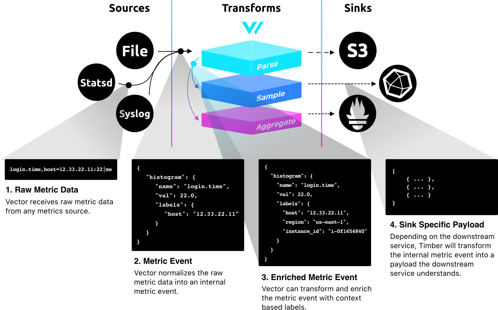

# InfluxDB + Vector :ok_hand:

##  InfluxDB
[InfluxDB](https://www.influxdata.com/products/influxdb-overview/) is open source time series database, purpose-built by InfluxData for monitoring metrics and events, provides real-time visibility into stacks, sensors, and systems. Use InfluxDB to capture, analyze, and store millions of points per second and much more.

## Vector
[Vector](https://vector.dev) is a highly reliable observability data router built for demanding production environments. On top of this basic functionality, Vector adds a few important enhancements:
1. A **richer data model**, supporting not only logs but aggregated metrics, fully structured events, etc
1. **Programmable transforms** written in lua (or eventually wasm) that let you parse, filter, aggregate, and otherwise manipulate your data in arbitrary ways
1. **Uncompromising performance** and efficiency that enables a huge variety of deployment strategies

## Architecture



## InfluxDB Metrics Sink

The Vector `influxdb_metrics` sink [batches](https://vector.dev/docs/meta/glossary/#batch) [metric](https://vector.dev/docs/about/data-model/metric/) events to InfluxDB using [v1](https://docs.influxdata.com/influxdb/latest/tools/api/#write-http-endpoint) or [v2](https://v2.docs.influxdata.com/v2.0/api/#tag/Write) HTTP API.

### Vector Metric Types

InfluxDB uses [line protocol](https://v2.docs.influxdata.com/v2.0/reference/syntax/line-protocol/) to write data points. It is a text-based format that provides the measurement, tag set, field set, and timestamp of a data point.

The following matrix outlines how Vector metric types are mapped into InfluxDB Line Protocol fields.

| Vector Metrics                                                                        | Line Protocol Fields                             | Example                                                                                                                                                   |
|---------------------------------------------------------------------------------------|--------------------------------------------------|-----------------------------------------------------------------------------------------------------------------------------------------------------------|
| [Counter](https://vector.dev/docs/about/data-model/metric/#counter)                   | value                                            | `ns.total,metric_type=counter value=1.5 1542182950000000011`                                                                                              |
| [Gauge](https://vector.dev/docs/about/data-model/metric/#gauge)                       | value                                            | `ns.meter,metric_type=gauge,normal_tag=value,true_tag=true value=-1.5 1542182950000000011`                                                                |
| [Set](https://vector.dev/docs/about/data-model/metric/#set)                           | value                                            | `ns.users,metric_type=set,normal_tag=value,true_tag=true value=2 154218295000000001`                                                                      |
| [Histogram](https://vector.dev/docs/about/data-model/metric/#aggregated_histogram)    | buckets, count, sum                              | `ns.requests,metric_type=histogram,normal_tag=value,true_tag=true bucket_1=1i,bucket_2.1=2i,bucket_3=3i,count=6i,sum=12.5 1542182950000000011`            |
| [Summary](https://vector.dev/docs/about/data-model/metric/#aggregated_summary)        | quantiles, count, sum                            | `ns.requests_sum,metric_type=summary,normal_tag=value,true_tag=true count=6i,quantile_0.01=1.5,quantile_0.5=2,quantile_0.99=3,sum=12 1542182950000000011` |
| [Distribution](https://vector.dev/docs/about/data-model/metric/#distribution)         | min, max, median, avg, sum, count, quantile 0.95 | `ns.sparse_stats,metric_type=distribution avg=3,count=10,max=4,median=3,min=1,quantile_0.95=4,sum=30 1542182950000000011`                                 |

### Configuration example

#### InfluxDB v1
```toml
[sinks.my_sink_id]
  type = "influxdb_metrics"
  namespace = "service"
  endpoint = "https://us-west-2-1.aws.cloud1.influxdata.com"
  database = "vector-database"
  consistency = "one"
  retention_policy_name = "one_day_only"
  username = "vector-source"
  password = "${INFLUXDB_PASSWORD_ENV_VAR}"
```

#### InfluxDB v2
```toml
[sinks.my_sink_id]
  type = "influxdb_metrics"
  namespace = "service"
  endpoint = "https://us-west-2-1.aws.cloud2.influxdata.com"
  org = "my-org"
  bucket = "my-bucket"
  token = "${INFLUXDB_TOKEN_ENV_VAR}"
```  

### Showcase

To check how documentation looks like see - [https://vector.dev/docs/reference/sinks/](https://vector.dev/docs/reference/sinks/)


## Links
- Vector Pull Request: [feat(new sink): Initial `influxdb_metrics` sink implementation](https://github.com/timberio/vector/pull/1759)
- [InfluxDB](https://www.influxdata.com/products/influxdb-overview/)
- [What is Vector?](https://vector.dev/blog/introducing-vector/#what-is-vector)
- [Vector Metrics Model](https://vector.dev/docs/about/data-model/metric/)
