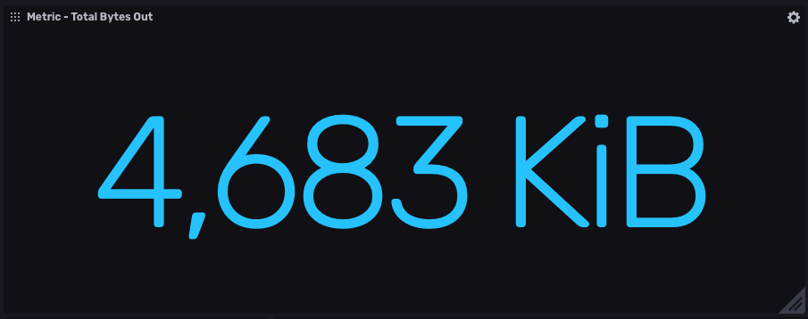
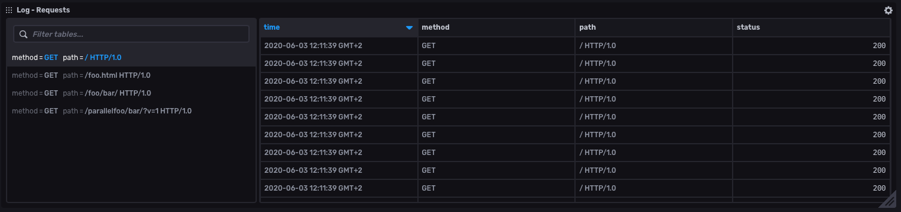

# InfluxDB + Vector :ok_hand:

- [InfluxDB](#influxdb)
- [Vector](#vector)
    - [Data Model](#data-model)
    - [InfluxDB Logs Sink](#influxdb-logs-sink)
    - [InfluxDB Metrics Sink](#influxdb-metrics-sink)
- [Monitoring Logs with Vector and InfluxDB](#monitoring-logs-with-vector-and-influxdb)
    - [Full configuration](#full-configuration)
    - [Conclusion](#conclusion)

## InfluxDB
[InfluxDB](https://www.influxdata.com/products/influxdb-overview/) is open source time series database, purpose-built by InfluxData for monitoring metrics and events, provides real-time visibility into stacks, sensors, and systems. Use InfluxDB to capture, analyze, and store millions of points per second and much more.

## Vector
[Vector](https://vector.dev) is a highly reliable observability data router built for demanding production environments. On top of this basic functionality, Vector adds a few important enhancements:
1. A **richer data model**, supporting not only logs but aggregated metrics, fully structured events, etc
1. **Programmable transforms** written in lua (or eventually wasm) that let you parse, filter, aggregate, and otherwise manipulate your data in arbitrary ways
1. **Uncompromising performance** and efficiency that enables a huge variety of deployment strategies

### Data Model

The individual pieces of data flowing through Vector are known as events. Events are arbitrarily wide, and deep, structured pieces of data. There are two types of events: `log` and `metric`.

#### Log
A `log` event is a structured represention of a point-in-time event. It contains an arbitrary set of fields (key/value pairs) that describe the event.

```json
{
  "host": "my.host.com",
  "message": "<13>Feb 13 20:07:26 74794bfb6795 root[8539]: i am foobar",
  "timestamp": "2019-11-01T21:15:47+00:00"
}
```

#### Metric
A `metric` event represents a numerical operation to a time series. Operations offered are heavily inspired by the StatsD and Prometheus models, and determine the schema of the metric structure within Vector.

```json
{
  "name": "login.count",
  "timestamp": "2019-11-01T21:15:47+00:00",
  "kind": "absolute",
  "tags": {
    "host": "my.host.com"
  },
  "counter": {
    "value": 24.2
  }
}
```

#### Why Not Just Events?

Existing services usually emit metrics, traces, and logs of varying quality. By designing Vector to meet services where they are (current state), Vector serve as a bridge to newer standards. This is why Vector place "events" at the top of data model, where logs and metrics are derived (traces coming soon).

## InfluxDB Logs Sink

> [official docs](https://vector.dev/docs/reference/sinks/influxdb_logs/)

The Vector `influxdb_logs` sink
[batches](https://vector.dev/docs/reference/sinks/influxdb_logs/#buffers--batches) [`log`](https://vector.dev/docs/about/data-model/log/) events to
[InfluxDB](https://www.influxdata.com/products/influxdb-overview/) using [v1](https://docs.influxdata.com/influxdb/latest/tools/api/#write-http-endpoint) or
[v2](https://v2.docs.influxdata.com/v2.0/api/#tag/Write) HTTP API.

### Mapping Log Event into Line Protocol

InfluxDB uses [line protocol](https://v2.docs.influxdata.com/v2.0/reference/syntax/line-protocol/) to write data points. It is a text-based format that provides the measurement, tag set, field set, and timestamp of a data point.

A `Log Event` event contains an arbitrary set of fields (key/value pairs) that describe the event.

The following matrix outlines how Log Event fields are mapped into InfluxDB Line Protocol:

| Field         | Line Protocol     |                                                                                                                                               
|---------------|-------------------|
| host          | tag               |
| message       | field             |
| source_type   | tag               |
| timestamp     | timestamp         |
| [custom-key]  | field             |

The default behaviour could be overridden by a [`tags`](https://vector.dev/docs/reference/sinks/influxdb_logs/#tags) configuration.

#### Mapping example

The following example shows how is `Log Event` mapped into `Line Protocol`:

##### Log Event

```js
{
  "host": "my.host.com",
  "message": "<13>Feb 13 20:07:26 74794bfb6795 root[8539]: i am foobar",
  "timestamp": "2019-11-01T21:15:47+00:00",
  "custom_field": "custom_value"
}
```

##### Line Protocol

```influxdb_line_protocol
ns.vector,host=my.host.com,metric_type=logs custom_field="custom_value",message="<13>Feb 13 20:07:26 74794bfb6795 root[8539]: i am foobar" 1572642947000000000
```

### Configuration example

#### InfluxDB v1
```toml
[sinks.my_sink_id]
  type = "influxdb_logs"
  namespace = "service"
  endpoint = "https://us-west-2-1.aws.cloud1.influxdata.com"
  database = "vector-database"
  consistency = "one"
  retention_policy_name = "one_day_only"
  username = "vector-source"
  password = "${INFLUXDB_PASSWORD_ENV_VAR}"
```

#### InfluxDB v2
```toml
[sinks.my_sink_id]
  type = "influxdb_logs"
  namespace = "service"
  endpoint = "https://us-west-2-1.aws.cloud2.influxdata.com"
  org = "my-org"
  bucket = "my-bucket"
  token = "${INFLUXDB_TOKEN_ENV_VAR}"
``` 

## InfluxDB Metrics Sink

> [official docs](https://vector.dev/docs/reference/sinks/influxdb_metrics/)

The Vector `influxdb_metrics` sink [batches](https://vector.dev/docs/meta/glossary/#batch) [metric](https://vector.dev/docs/about/data-model/metric/) events to InfluxDB using [v1](https://docs.influxdata.com/influxdb/latest/tools/api/#write-http-endpoint) or [v2](https://v2.docs.influxdata.com/v2.0/api/#tag/Write) HTTP API.

### Vector Metric Types

InfluxDB uses [line protocol](https://v2.docs.influxdata.com/v2.0/reference/syntax/line-protocol/) to write data points. It is a text-based format that provides the measurement, tag set, field set, and timestamp of a data point.

The following matrix outlines how Vector metric types are mapped into InfluxDB Line Protocol fields.

| Vector Metrics                                                                        | Line Protocol Fields                             | Example                                                                                                                                                   |
|---------------------------------------------------------------------------------------|--------------------------------------------------|-----------------------------------------------------------------------------------------------------------------------------------------------------------|
| [Counter](https://vector.dev/docs/about/data-model/metric/#counter)                   | value                                            | `ns.total,metric_type=counter value=1.5 1542182950000000011`                                                                                              |
| [Gauge](https://vector.dev/docs/about/data-model/metric/#gauge)                       | value                                            | `ns.meter,metric_type=gauge,normal_tag=value,true_tag=true value=-1.5 1542182950000000011`                                                                |
| [Set](https://vector.dev/docs/about/data-model/metric/#set)                           | value                                            | `ns.users,metric_type=set,normal_tag=value,true_tag=true value=2 154218295000000001`                                                                      |
| [Histogram](https://vector.dev/docs/about/data-model/metric/#aggregated_histogram)    | buckets, count, sum                              | `ns.requests,metric_type=histogram,normal_tag=value,true_tag=true bucket_1=1i,bucket_2.1=2i,bucket_3=3i,count=6i,sum=12.5 1542182950000000011`            |
| [Summary](https://vector.dev/docs/about/data-model/metric/#aggregated_summary)        | quantiles, count, sum                            | `ns.requests_sum,metric_type=summary,normal_tag=value,true_tag=true count=6i,quantile_0.01=1.5,quantile_0.5=2,quantile_0.99=3,sum=12 1542182950000000011` |
| [Distribution](https://vector.dev/docs/about/data-model/metric/#distribution)         | min, max, median, avg, sum, count, quantile 0.95 | `ns.sparse_stats,metric_type=distribution avg=3,count=10,max=4,median=3,min=1,quantile_0.95=4,sum=30 1542182950000000011`                                 |

### Configuration example

#### InfluxDB v1
```toml
[sinks.my_sink_id]
  type = "influxdb_metrics"
  namespace = "service"
  endpoint = "https://us-west-2-1.aws.cloud1.influxdata.com"
  database = "vector-database"
  consistency = "one"
  retention_policy_name = "one_day_only"
  username = "vector-source"
  password = "${INFLUXDB_PASSWORD_ENV_VAR}"
```

#### InfluxDB v2
```toml
[sinks.my_sink_id]
  type = "influxdb_metrics"
  namespace = "service"
  endpoint = "https://us-west-2-1.aws.cloud2.influxdata.com"
  org = "my-org"
  bucket = "my-bucket"
  token = "${INFLUXDB_TOKEN_ENV_VAR}"
```  

### Links
- [What is Vector?](https://vector.dev/blog/introducing-vector/#what-is-vector)
- Vector PRs:
  - [feat(new sink): Initial `influxdb_metrics` sink implementation](https://github.com/timberio/vector/pull/1759)
  - [feat(new sink): Initial `influxdb_logs` sink implementation](https://github.com/timberio/vector/pull/2474)
- [InfluxDB](https://www.influxdata.com/products/influxdb-overview/)

# Monitoring Logs with Vector and InfluxDB

[Vector](https://vector.dev) is highly reliable data router to take control of your observability data. 
It's has possibility to collect, transform and route date by declarative way in one tool. 
Vector is designed to follow `high reliability`, `operator safety` and `one tool` principles. 
Engineering team uses Vector to tame observability pipelines.

In this article I will describe how to monitor logs from [Apache HTTP Server](https://httpd.apache.org). Our observability pipeline will be use a [Syslog Source](https://vector.dev/docs/reference/sources/syslog/) to ingests data through the Syslog protocol. 


<sup>Architecture diagram from [Vector docs](https://vector.dev/docs/about/data-model/): Data Model</sup>

This tutorial assumes that you have account at [InfluxDB Cloud free tier](https://www.influxdata.com/influxdb-cloud-pricing/).

## Dockerized environment 

To simply setup our observability pipeline we will create a Dockerized environment. 
The Apache HTTP Server and Vector will be run as a separate Docker container and communicate through [Docker bridge network](https://docs.docker.com/network/bridge/).  


So let's create and start a docker network:

```bash
docker network create -d bridge influx_network \
       --subnet 192.168.0.0/24 \
       --gateway 192.168.0.1
```

## Routes Apache log to Syslog

The Docker has [multiple](https://docs.docker.com/config/containers/logging/configure/#supported-logging-drivers) logging mechanisms to help get logs from running services to correct destination. We configure our dockerized Apache to use the [Syslog logging driver](https://docs.docker.com/config/containers/logging/syslog/):

```bash   
docker run \
       --detach \
       --name web \
       --network influx_network \
       --publish 8080:80 \
       --log-driver=syslog\
       --log-opt syslog-address=udp://localhost:5140 \
       httpd
```                      

Now we are ready to check connection to your new Apache Web Server instance: [http://localhost:8080/](http://localhost:8080/).

## Vector routing

Vector has capabilities to ingesting a lot of types of [sources](https://vector.dev/docs/reference/sources/) into pipeline - [file](https://vector.dev/docs/reference/sources/file/), [journald](https://vector.dev/docs/reference/sources/journald/), [kafka](https://vector.dev/docs/reference/sources/kafka/)... 
The *Sources* can both receive and pull in data. We want to use a source that receive data over the network via `syslog`.

The whole Vector pipeline is defined via `vector.toml` configuration file.

### Syslog Source

The Vector `syslog` source ingests data through the Syslog protocol and outputs [log](https://vector.dev/docs/about/data-model/log/) events.

Define Syslog source that listen on port 5140:

```toml
[sources.syslog]
  type = "syslog"
  mode = "udp"
  address = "0.0.0.0:5140"
```  

Now it's time to extract useful information from Apache Log into [metrics](https://vector.dev/docs/about/data-model/metric/).

### Transform logs

The Apache log looks like:

```
192.168.0.1 - - [10/Feb/2000:12:00:00 +0900] "GET / HTTP/1.1" 200 777
```    

We use a [regex_parser](https://vector.dev/docs/reference/transforms/regex_parser/) to extract field's value for: `host`, `user`, `timestamp`, `method`, `path`, `status` and `bytes_out`.

```toml
[transforms.regex_parser]
  inputs = ["syslog"]
  type = "regex_parser"
  regex = '^(?P<host>[\w\.]+) - (?P<user>[\w-]+) \[(?P<timestamp>.*)\] "(?P<method>[\w]+) (?P<path>.*)" (?P<status>[\d]+) (?P<bytes_out>[\d]+)$'
```      

Next step is calculate useful metrics. For that we need to transform `log event` into `metric event` by [log_to_metric](https://vector.dev/docs/reference/transforms/log_to_metric/). Let's calculate sum of outgoing bytes tagged by `method` and `status`:

```toml
[transforms.log_to_metric]
  inputs = ["regex_parser"]
  type = "log_to_metric" 

[[transforms.log_to_metric.metrics]]
  type = "counter"
  increment_by_value = true
  field = "bytes_out"
  tags = {method = "{{method}}", status = "{{status}}"}
``` 

And what is final step? Push data into InfluxDB!

### InfluxDB Sink

The [influxdb_metrics](https://vector.dev/docs/reference/sinks/influxdb_metrics/) 
batches metric events to InfluxDB using [v1](https://docs.influxdata.com/influxdb/latest/tools/api/#write-http-endpoint) 
or [v2](https://v2.docs.influxdata.com/v2.0/api/#tag/Write) HTTP API. Let's configure InfluxDB sink to push data into [InfluxDB 2 Cloud free tier](https://www.influxdata.com/influxdb-cloud-pricing/): 

```toml 
[sinks.influxdb_2]
  type = "influxdb_metrics"
  inputs = ["log_to_metric"]
  namespace = "vector"
  endpoint = "https://us-west-2-1.aws.cloud2.influxdata.com"
  org = "My Company"
  bucket = "vector"
  token = "jSc6rmToXkx6y8vOv1ruac4ZCvYNpGtGzHkrJsF84bi0q9olFjpV6h6yv1f5xNs26_cHVURarPIpd6Bklvfe-w=="
```     

### Full configuration

```toml
#                                    __   __  __
#                                    \ \ / / / /
#                                     \ V / / /
#                                      \_/  \/
#
#                                    V E C T O R
#                                   Configuration
#
# ------------------------------------------------------------------------------
# Website: https://vector.dev
# Docs: https://vector.dev/docs/
# ------------------------------------------------------------------------------
  
#
# Incoming Syslog source
#
[sources.syslog]
  type = "syslog"
  mode = "udp"
  address = "0.0.0.0:5140"

#
# Transform logs into metrics
#
[transforms.regex_parser]
  inputs = ["syslog"]
  type = "regex_parser"
  regex = '^(?P<host>[\w\.]+) - (?P<user>[\w-]+) \[(?P<timestamp>.*)\] "(?P<method>[\w]+) (?P<path>.*)" (?P<status>[\d]+) (?P<bytes_out>[\d]+)$'

[transforms.log_to_metric]
  inputs = ["regex_parser"]
  type = "log_to_metric"

[[transforms.log_to_metric.metrics]]
  type = "counter"
  increment_by_value = true
  field = "bytes_out"
  tags = {method = "{{method}}", status = "{{status}}"}

#
# Output data into InfluxDB 2
#
[sinks.influxdb_2]
  type = "influxdb_metrics"
  inputs = ["log_to_metric"]
  namespace = "vector"
  endpoint = "https://us-west-2-1.aws.cloud2.influxdata.com"
  org = "My Company"
  bucket = "vector"
  token = "jSc6rmToXkx6y8vOv1ruac4ZCvYNpGtGzHkrJsF84bi0q9olFjpV6h6yv1f5xNs26_cHVURarPIpd6Bklvfe-w=="
```       

## Bring Vector's pipeline to live

The Vector supports wide range of platform. You are able to run Vector on Windows, Linux, MacOS, ARMs and also provides packages for popular
managers as [DPKG](https://vector.dev/docs/setup/installation/package-managers/dpkg/), [Homebrew](https://vector.dev/docs/setup/installation/package-managers/homebrew/), [RPM](https://vector.dev/docs/setup/installation/package-managers/rpm/) and so on.
We will use [Docker](https://vector.dev/docs/setup/installation/containers/docker/) image available on [Docker Hub](https://hub.docker.com/r/timberio/vector).

Run the Vector Docker image with our `vector.tml`:

```bash
docker run \
       --name vector \
       --network influx_network \
       --publish 5140:5140/udp \
       --volume "${PWD}"/vector.toml:/etc/vector/vector.toml:ro \
       timberio/vector:nightly-2020-02-19-alpine
```    

## Visualize metrics in InfluxDB

Now it’s time to create some charts. To do this, log in into InfluxDB and create Dashboard cells with flowing Flux queries:


```flux
from(bucket: "vector")
  |> range(start: v.timeRangeStart, stop: v.timeRangeStop)
  |> filter(fn: (r) => r._measurement == "vector.bytes_out")
  |> filter(fn: (r) => r._field == "value")
```



```flux  
from(bucket: "vector")
  |> range(start: 0)
  |> filter(fn: (r) => r._measurement == "vector.bytes_out")
  |> filter(fn: (r) => r._field == "value") 
  |> toInt()
  |> sum(column: "_value")
  |> map(fn: (r) => ({ r with _value: r._value / 1024 }))
```



```flux
from(bucket: "vector")
  |> range(start: v.timeRangeStart, stop: v.timeRangeStop)
  |> filter(fn: (r) => r._measurement == "vector.bytes_out")
```

and result should looks like:


## Conclusion

The [Vector](https://vector.dev) together with [InfluxDB](https://www.influxdata.com/products/influxdb-overview/)  is powerful tool set to handle observability pipelines. 
In this example we just cover only small piece of Vector possibilities. What about scripting in your pipelines? 
Yes - just use [lua](https://vector.dev/docs/reference/transforms/lua/) transformer. 
Geolocation of your logs? Yes - just use [geoip](https://vector.dev/docs/reference/transforms/geoip/) transformer... 

As always, if you run into hurdles, please share them on our [community site](https://community.influxdata.com/) or [Slack](https://influxcommunity.slack.com/join/shared_invite/enQtNjA4MTM2NDgyNDUwLTUxMDAzNmM1YzJmOTNhMGE0ZjI2NzUxNzE4YjQ2OTY3MjVhNDlkNzFlMTZiZGJiOTIyNGE1ZDY3MGFmY2Q0OWE) channel. We’d love to get your feedback and help you with any problems you run into.

The script that run everything together can be found [here](https://github.com/bonitoo-io/influxdb-vector-demo/blob/master/run-demo.sh) and exported InfluxDB template [here](https://github.com/bonitoo-io/influxdb-vector-demo/blob/master/monitoring_logs_with_vector_and_influxdb.yml).